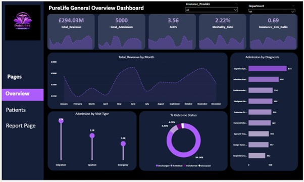
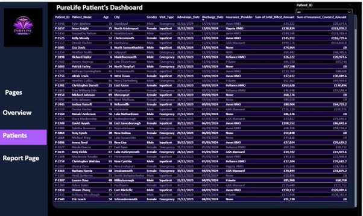

# PureLife-Hospital-Performance-Dashboard
The PureLife General Overview Dashboard summarizes hospital performance and patient activity by showing key metrics such as revenue, admissions, length of stay, mortality rate, insurance coverage, diagnosis trends, visit types, and outcomes to support better healthcare planning and decision-making.


Here it is again:


## Table of Contents

1. [Introduction](#introduction)
2. [Problem Statement](#problem-statement)
3. [Project Overview](#project-overview)
4. [PureLife Hospital Performance Dashboard](#purelife-hospital-performance-dashboard)
5. [PureLife Patients Dashboard](#purelife-patients-dashboard)
6. [Recommendation](#recommendation)
7. [Conclusion](#conclusion)

# PureLife Hospital Analytics Dashboard Project Writeup

## Introduction

The PureLife Hospital Analytics Dashboard is a healthcare business intelligence project developed to provide a clear, interactive, and data-driven view of hospital operations, patient activity, financial performance, and clinical outcomes. The dashboard was designed to help hospital administrators, healthcare managers, and decision-makers monitor key performance indicators in one central reporting environment.

Using visual analytics, the project transforms hospital records into meaningful insights by presenting information on revenue, patient admissions, visit types, diagnosis categories, insurance coverage, treatment outcomes, and patient-level details. This allows stakeholders to quickly understand hospital performance, identify operational patterns, and make better decisions that support patient care and resource planning.

## Problem Statement

Hospitals generate large volumes of patient, financial, and operational data daily. However, when this data is stored in raw tables or separate systems, it becomes difficult for management to quickly identify trends, monitor performance, or make timely decisions.

PureLife Hospital needed a structured reporting solution that could answer important business and healthcare questions such as:

- What is the total revenue generated by the hospital?
- How many patients were admitted?
- What is the average length of hospital stay?
- What are the common diagnosis categories?
- What patient visit types generate the highest admission volume?
- What percentage of patients were discharged, admitted, transferred, or deceased?
- How much of the hospital bill is covered by insurance?
- Which patient records contribute to billing and insurance activity?

The main problem addressed by this project is the lack of a centralized and visual reporting system for monitoring hospital performance and patient activity effectively.

## Project Overview

The PureLife Hospital Analytics Dashboard was built to provide both high-level and detailed insights into hospital operations. The project contains two major dashboard pages:

1. **PureLife Hospital Performance Dashboard**
2. **PureLife Patients Dashboard**

The Hospital Performance Dashboard gives an executive summary of key hospital metrics, trends, and outcomes, while the Patients Dashboard provides a detailed table view of individual patient records, including demographic, admission, billing, and insurance information.

The dashboard includes filters for insurance provider, department, and patient ID, allowing users to interact with the report and focus on specific areas of interest. This makes the dashboard useful for both strategic management reporting and operational review.
## Dashboard 


## Detailed Analysis 

The dashboard provides a broad view of PureLife Hospital’s operational and financial performance. From the overview page, the hospital recorded a total revenue of approximately **£94.03M**, with **500 total admissions** captured in the report. The average length of stay is **3.5 days**, suggesting that patients typically spend a moderate number of days in care before discharge or transfer.

The mortality rate is shown as **2.2%**, which gives management a quick view of patient outcome risk across the hospital. The insurance coverage ratio is **0.69**, indicating that a significant portion of hospital billing is covered by insurance providers.

Revenue is also analyzed by month, helping the hospital understand how income changes over time. This is important for identifying seasonal trends, high-performing months, and possible periods of reduced hospital activity.

The dashboard also analyzes admissions by visit type. Outpatient visits appear to have the highest admission count, followed by inpatient and emergency visits. This helps management understand where patient demand is coming from and how resources should be allocated across departments.

Diagnosis analysis provides insight into the most common medical conditions handled by the hospital. Categories such as hypertension, infection, cardiovascular conditions, malignancy, endocrine-related cases, respiratory issues, injury and poisoning, gastroenteritis, and neurological conditions are displayed. This helps the hospital identify major areas of clinical demand and plan staffing, equipment, and treatment resources accordingly.

Patient outcome analysis shows the proportion of patients who were discharged, admitted, transferred, or deceased. A large percentage of outcomes appear to be discharged, which suggests that many patients completed treatment and left the hospital successfully.

## PureLife Hospital Performance Dashboard

The PureLife Hospital Performance Dashboard is the main executive summary page of the report. It presents key performance indicators and visual insights that allow users to quickly assess the hospital’s overall performance.

### Key Metrics Displayed

- **Total Revenue:** £94.03M
- **Total Admissions:** 500
- **Average Length of Stay:** 3.5 days
- **Mortality Rate:** 2.2%
- **Insurance Coverage Ratio:** 0.69

### Main Visuals

The dashboard includes the following visuals:

- **Total Revenue by Month:**  
  Shows revenue movement across the year and helps identify monthly financial trends.

- **Admission by Visit Type:**  
  Breaks down admissions into outpatient, inpatient, and emergency categories.

- **Outcome Status:**  
  Displays the percentage distribution of discharged, admitted, transferred, and deceased patients.

- **Admission by Diagnosis:**  
  Highlights the most common diagnosis categories contributing to hospital admissions.

### Business Value

This dashboard helps management monitor hospital performance at a glance. It supports decision-making by showing where revenue is generated, how patients are admitted, what conditions are most common, and what outcomes are being recorded. It is especially useful for executive reporting, performance tracking, and operational planning.

## PureLife Patients Dashboard

The PureLife Patients Dashboard provides a detailed patient-level view of the hospital data. It contains a structured table showing individual patient records and related hospital information.

### Key Fields Displayed

The table includes fields such as:

- Patient ID
- Patient Name
- Age
- City
- Gender
- Visit Type
- Admission Date
- Discharge Date
- Insurance Provider
- Total Billed Amount
- Insurance Covered Amount

### Purpose of the Patients Dashboard

This dashboard allows users to review detailed patient records and analyze billing and insurance activity at a more granular level. It supports patient-level investigation, financial auditing, and insurance claim review.

For example, hospital administrators can use this page to identify patients by visit type, compare billed amounts with insurance coverage, and review admission and discharge information. The Patient ID filter also allows users to focus on a specific patient record when required.

### Business Value

The Patients Dashboard improves transparency by connecting financial metrics to individual patient records. It helps the hospital understand how billing, insurance coverage, patient demographics, and visit types relate to overall hospital performance.

## Recommendation

Based on the dashboard insights, the following recommendations can help PureLife Hospital improve performance and decision-making:

1. **Monitor High-Volume Diagnosis Categories**  
   The hospital should pay close attention to the most common diagnosis categories, such as hypertension, infection, and cardiovascular-related cases. This can help with better clinical planning, resource allocation, and preventive care programs.

2. **Improve Insurance Coverage Analysis**  
   Since insurance coverage plays a major role in hospital revenue, the hospital should regularly analyze insurance providers, covered amounts, and unpaid balances to reduce financial risk.

3. **Optimize Resource Allocation by Visit Type**  
   Outpatient, inpatient, and emergency visits should be reviewed regularly to ensure that staffing, equipment, and departmental resources match patient demand.

4. **Track Mortality and Outcome Trends**  
   The mortality rate and patient outcome status should be monitored over time to identify areas where care quality, treatment processes, or emergency response can be improved.

5. **Use Monthly Revenue Trends for Financial Planning**  
   Monthly revenue analysis should support budgeting, forecasting, and strategic financial planning. Months with lower revenue should be investigated to understand the cause.

6. **Enhance Patient-Level Reporting**  
   The Patients Dashboard should continue to be used for detailed reviews of billing, insurance claims, and patient admission records. This can support audit processes and improve operational accountability.

## Conclusion

The PureLife Hospital Analytics Dashboard provides a professional and effective reporting solution for monitoring hospital performance, patient activity, revenue, insurance coverage, and clinical outcomes. By combining executive-level summaries with patient-level details, the dashboard gives stakeholders a complete view of hospital operations.

The project successfully turns raw healthcare data into clear visual insights that support better planning, improved resource allocation, financial monitoring, and patient care management. Overall, the dashboard serves as a valuable decision-support tool for PureLife Hospital and can help management make more informed, timely, and data-driven decisions.
```
```


